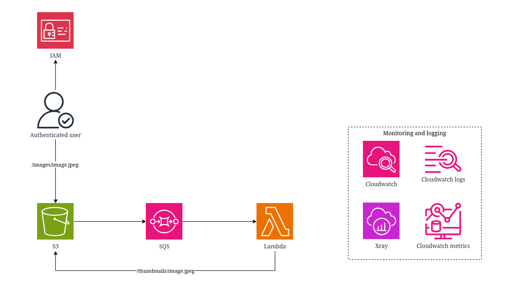

# Serverless Thumbnail Generator

## 1. Project Overview
This project provides a **serverless image thumbnail generator** using **AWS Lambda**, **Amazon S3**, and **Terraform** for infrastructure management. 

When an image is uploaded to a designated S3 bucket, the Lambda function automatically resizes it into a thumbnail (default: **200x200 max**) while preserving the aspect ratio. The generated thumbnail is then stored back in S3.

---

## 2. Architecture

- **Amazon S3** – Stores original images and generated thumbnails.
- **AWS Lambda** – Processes images and creates thumbnails.
- **AWS X-Ray** – Provides distributed tracing for monitoring and debugging.
- **Amazon CloudWatch** – Stores logs and custom metrics.
- **Terraform** – Provisions AWS resources (S3 buckets, Lambda function, IAM roles, etc.).
- **IAM Roles & Policies** – Securely grant Lambda access to S3, CloudWatch, and X-Ray.

**Flow:**
1. User uploads an image to the S3 source bucket.
2. S3 triggers the Lambda function.
3. Lambda resizes the image (max 200x200).
4. The thumbnail is stored in the S3 destination bucket.
5. Metrics and traces are sent to CloudWatch and X-Ray.



---

## 3. Requirements

- **AWS Account** with permissions to deploy Lambda, S3, IAM, CloudWatch, and X-Ray.
- **Terraform** (>= 1.0.0).
- **Python 3.9+** (for local testing).
- **PIP** for Python dependencies.
- **AWS CLI** (configured with credentials).

---

## 4. Setup & Installation

### Clone Repository
```bash
git clone https://github.com/your-repo/serverless-thumbnail-generator.git
cd serverless-thumbnail-generator
```

### Install Dependencies (for local testing)
```bash
cd lambda-function
pip install -r requirements.txt
```

### Test Locally
```bash
python test_local.py ./demo-assets/sample.jpg
```
This will generate a thumbnail locally without deploying to AWS.

---

## 5. Deployment

### Initialize Terraform
```bash
cd terraform
terraform init
```

### Preview Changes
```bash
terraform plan
```

### Apply Deployment
```bash
terraform apply
```

Terraform will:
- Create an S3 bucket for source images.
- Create an S3 bucket for thumbnails.
- Deploy the Lambda function.
- Configure necessary IAM roles and permissions.

---

## 6. Usage

1. Upload an image to the **source S3 bucket**.
   ```bash
   aws s3 cp ./demo-assets/sample.jpg s3://<your-source-bucket>/
   ```

2. Lambda will automatically generate a thumbnail and place it in the **thumbnail S3 bucket**.

3. Retrieve the thumbnail:
   ```bash
   aws s3 cp s3://<your-thumbnail-bucket>/sample.jpg ./thumbnail.jpg
   ```

4. Monitor logs and metrics:
   ```bash
   aws logs tail /aws/lambda/<your-lambda-function-name> --follow
   ```

---

